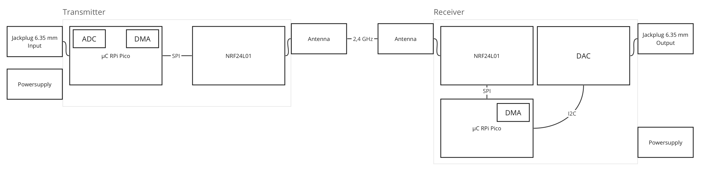

# Guitar Transmitter

Team-Members: Kai Mayer, Kevin Reifschneider, Maximilian Knobloch, Mehmet Sahin Uces

This project contains the source code and documentation for the cableless guitar transmitter. You can find a short description of what we are building in the following block:

As part of the course Embedded Systems (WS23/24) we are building a cableless guitar transmitter. We have a sender and a receiver that communicate over 2,4 GHz radio frequency. Plug in the sender into your guitar and the receiver into your amplifier, put both on and start playing. The sender will digitalize the input signal from the guitar and send it to the receiver. The receiver will turn the signal into an analog signal and put it into the amplifier. The reaction time to digitalize, send, receive and turn back into an analog signal again should take less than 5 ms.

## Hardware requirements

- 4x Raspberry Pi Pico ([Reichelt](https://www.reichelt.de/raspberry-pi-pico-rp2040-cortex-m0-microusb-rasp-pi-pico-p295706.html))
- 2x NRF24L01 ([AZ-Delivery](https://www.az-delivery.de/en/products/3x-nrf24l01-mit-2-4-ghz), [Makershop](https://www.makershop.de/module/funk/nrf24l01-pa-lna-sma-antenne/))
- 2x 6,35mm Jackplug male mono ([Maltronic](https://maltronic.de/detail/index/sArticle/35598))
- 1x Digital-to-Analog Converter ([Reichelt](https://www.reichelt.de/de/de/entwicklerboards-dac-konverter-mcp4725-debo-dac-mcp4725-p334976.html))
2x Raspberry Pi Debug Probe 
- 2x Batterycase
- Cables
- PCB

   *^Links for reference*

## Hardware overview

## Tasks

//TODO: add tasks
