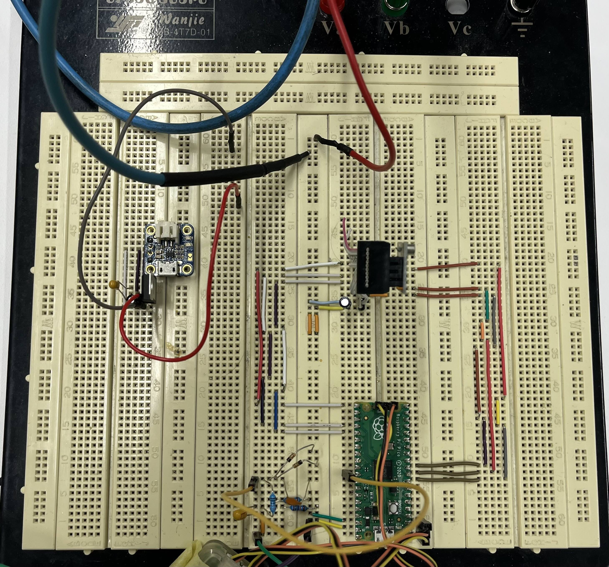
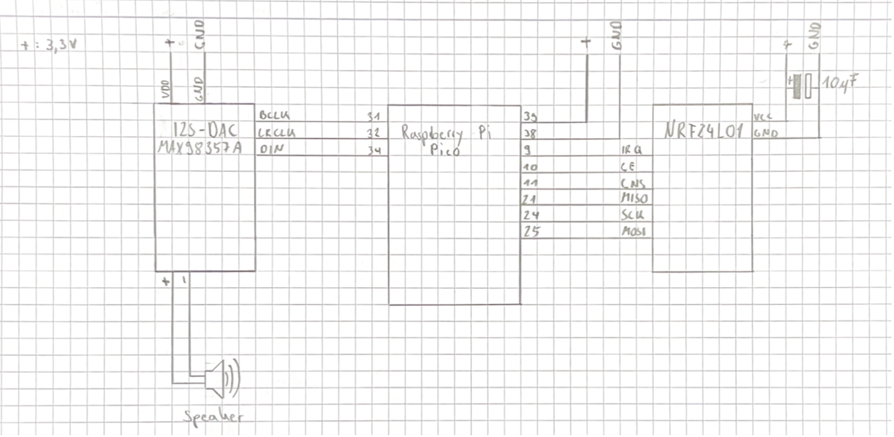

# Project Design and Realization




## Wiring Diagram


At the top left of the picture is a circuit that applies a bias voltage to the sine signal. Our ADC cannot measure negative voltages. By adding the bias voltage, to raise the sine wave along the y-axis, the zero point of our signal is halfway up the 3.3V scale, at 1.65V. This allows us to measure the `negative` sine waves of the guitar signal.

The components used for the receiver are

- a Raspberry Pi Pico to process the audio signal
- an NRF24L01 for transmitting a radio signal
- an MAX98457A digital to analog converter for audio output



The components used for the battery management are

- a Battery Charger to be able to chare the LiPo
- a LF33 to get stable output voltage of 3,3V


## Requirement Analysis

### Functional Requirements

1. **Wireless Connectivity:** The system must establish reliable wireless communication between the guitar transmitter and amplifier receiver. The wireless connection should be seamless and support a minimum effective range of 5m.

2. **Analog-to-Digital Conversion:** The system must include an Analog-to-Digital Converter (ADC) within the Raspberry Pi Pico to convert analog signals from the guitar into digital signals.

3. **Digital-to-Analog Conversion:** The system must include a Digital-to-Analog Converter (DAC) module to convert digital signals back into analog signals for audio output.

4. **Real-time Audio Transmission:** Low latency is crucial for real-time audio transmission. The system should ensure minimal delay between playing the guitar and hearing the audio output from the amplifier.

5. **Clear Audio Signals:** Clear audio signals are essential. The wireless transmission of audio signals should maintain high fidelity and clarity to provide a quality listening experience for the musician.

6. **Debugging and Development Tools:** Integration with the Raspberry Pi Debug Probe for efficient code development and   debugging.

### Non-functional Requirements

1. **Usability:** The system should be easy to use, even for amateur musicians.

2. **Reliability:** The wireless connection should be strong and reliable, with minimal signal dropouts or interference.

3. **Documentation:** Comprehensive documentation should be provided for users, including setup instructions, troubleshooting guides, and technical specifications.

## Architecture

### Hardware Architecture

#### Raspberry Pi Pico

The primary micro processing unit is responsible for converting the guitar's analog signals to digital. It interfaces with both the ADC and the NRF24L01 transceiver module.

#### Analog-to-Digital Converter (ADC)

The analog signals from the electric guitar are converted into digital signals by the ADC embedded in the Raspberry Pi Pico. This conversion is crucial for wireless audio processing and transmission.

#### NRF24L01 Transceiver Module

The NRF24L01 facilitates wireless communication between the guitar transmitter and the amplifier receiver, allowing for the transmission and reception of digital audio data via radio frequency.

#### Digital-to-Analog Converter (DAC)

The MAX98357 DAC module converts digital signals into analog signals that are suitable for audio output through the amplifier.

#### Raspberry Pi Debug Probe

The probe interfaces with the Raspberry Pi Pico for debugging and code development purposes. It provides developers with tools to ensure the reliability and functionality of the code base.

#### Guitar Transmitter and Amplifier Receiver

The guitar transmitter is a small device that can be attached to an electric guitar. It contains the transmitter module and necessary power components. The Amplifier Receiver, which is located near the amplifier, houses the receiver module and DAC.

### Software Architecture

#### Visual Studio Code and Pico SDK

Development environment for writing, compiling, and debugging code. The use of Pico SDK in conjunction with Visual Studio Code facilitates efficient software development in C++.

We opted to use CMake and the Pico SDK to build the project. Our initial approach involved using PlatformIO to build the project, manage dependencies, and configure build settings, was not successful. Unfortunately, we encountered a limitation as there was only a community PlatformIO configuration available for the Pi Pico, incorporating the Arduino Framework mapped to Pico hardware. We decided against utilizing this configuration because the introduced layer of abstraction was deemed unnecessary and unhelpful for our project's specific focus on timing the audio data. It was crucial for us to stay close to the hardware to maintain control over the execution timing of various operations.

#### C++ Compiler and CMake

The programming language for the project is C++, and the C++ compiler, along with CMake, is utilized to compile and build the code for the Raspberry Pi Pico. We use the <https://developer.arm.com/Tools%20and%20Software/GNU%20Toolchain> GNU ARM Toolchain for our platform.

#### RF24 Library (<https://nrf24.github.io/RF24/>)

As described in the Software chapter in the introduction, we decided to use the RF24 library for the SPI communication between the Raspberry Pi Pico and the NRF24L01 module. The library took over the part, implementing the specific reads and writes on a register in order to get the right settings and operating modes. Furthermore, the library has some very nice features to print all the settings which are set on the chip, which helped us debug the chip and find problems in our settings. An issue we encountered was that the address which is used as read/write address for the transmitted data, must be the same on each chip. With the output from the library, we got a good overview of the settings used including the read and write address.

#### Pico Extras/Pico Audio (<https://github.com/raspberrypi/pico-extras>)

To play our 8-bit unsigned PCM audio data on our DAC using the I2S protocol, we utilized the Pico Audio Library from Pico-Extras. Primarily, we decided to employ this library because the Pico does not inherently support the I2S protocol, and it is not included in the Pico SDK. To communicate with the I2S interface of the DAC, we had to program the state machine of the I/O’s. A state machine program for the I2S interface is implemented in the Pico Extras. Furthermore, the I2S library is designed to utilize the direct memory access (DMA) of the Pico when playing audio data. Using DMA was necessary for us, as you can read later in the chapter about the Digital-to-Analog Converter.

### Communication Flow


## Implementation / Software

### Transmitter


The initialization of the system occurs in the following steps:

`std_init`: Initializes UART and USB for communication with the debugger and the host PC.

`spi_begin`: Initializes the SPI connection between the Raspberry Pi Pico and the NRF24L01 transceiver for the transmission of commands and data payloads.

`radio_begin`: Checks the SPI connection after initialization using "spi_begin".

`rf24Setup`: The NRF24L01 transceiver is being initialized. The power amplification has been set to the maximum to achieve the best possible signal. The payload size per packet is 16 bytes. After conducting tests between 2mbps and 500 kbps, we opted for 2mbps because the quality of 500kbps was not sufficient. Due to the real-time nature of the system, automatic packet acknowledgment (ACK) was disabled, as it significantly increased packet latency, preventing them from being sent in a timely manner. The CRC (Cyclic Redundancy Check) for detecting bit errors in the packets was also turned off. In this case, faulty packets are now accepted and played instead of being discarded. Playing corrupt packets was rated acoustically better than playing packets with missing information by averaging. Finally, the transceiver is set to transmit mode, and the settings of the transceiver are printed to the host system's console via UART using Pretty Print.

`sig_acq_init`: The process begins with the initialization of the ADC through the Pico SDK. Subsequently, the calculation of cycles needed to achieve a sampling frequency of 20,000 Hz takes place. It is crucial to note that the function "adc_set_clkdiv()" doesn't merely expect a divisor; rather, it anticipates the number of cycles that must elapse before the next sample transformation occurs.
With the help of the variables:

- `DEFAULT_FREQ` = 500.000 Hz (ADC default)
- `ADC_TARGET_FREQ` = 20.000 Hz (our defined sampling rate)
- `CYCLES_PER_TRANSFORMATION` ? 96 Cycles (defined in the datasheet)

the required number of cycles for the target frequency is calculated:

```math
TARGET_DIV_CYC = ADC_DEFAULT_FREQ / ADC_TARGET_FREQ * CYCLES_PER_TRANSFORMATION
2400 Cycles    = 500.000 Hz       / 20.000 Hz       * 96 Cycles = 25 * 96 Cycles
```

Following that, the complete initialization of the ADC pins takes place. The next step involves initializing the ADC FIFO. The sampled ADC data is automatically copied to one of our buffer groups (A or B) using DMA, thereby relieving the CPU. Simultaneously, it ensures the possibility of parallel transmission and sampling. The DMA channel is configured for CaptureBuffer A. It is important to note that, according to the datasheet, the ADC must not be started before activating the DMA, as this would compromise the proper functioning of the DMA. Subsequently, the main loop is executed.

#### Block audio processing

Since we already wait for Buffer A to be full during the initialization process of `siq_acq_init()`, we configure the DMA to write directly to Buffer B. Subsequently, we send Buffer A using the `startFastWrite()` function of the library. This method is the most basic for transmission, as the other methods in the library attempt to repeat packets through timeouts, even though these were already disabled during initialization.

The use of two buffers is explained by the illustration below. We take advantage of the fact that the DMA can operate in parallel with the CPU. While the CPU is busy sending Buffer X, the DMA simultaneously copies samples from the ADC register into the Buffer Y. After the sending process is completed, we check if the buffer is filled and block the process if it is not entirely filled. Subsequently, we simply swap the two buffers and repeat this process indefinitely to ensure a continuous transmission of information.


#### Prototype using queue_t (fail)


Our initial approach involved using the `ADC_IRQ_REQUEST` to write into a queue_t structure for multithreading from the Raspberry library via an interrupt. Subsequently, in the main method, the queue_t was cleared, and the packets were sent. We encountered issues with the quality of the sinusoidal signal, particularly concerning the order and intervals in the signal information.

The queue_t was slow and did not maintain order. This could be due to the dynamic memory allocation it performed, which required locks and synchronization to remain multithread-safety. Additionally, the order was not guaranteed since the fed data did not perfectly align with the pulled data from the main function. Timing measurement results were not available as the prototype was discarded after the discovery of the timing issue, necessitating a redevelopment of the implementation. In the image below, the signal can be evaluated.


First reception results in the project using the CRC setting and the high-level method `startWrite()` from the `RF24` library. Dealing with duplicate packets and incorrect order posed a significant challenge at this stage in the project, as it was initially unclear why packets were arriving multiple times while others were being skipped.


Above the visual representation of the capture buffer with the ADC from the function generator. Initial tests to verify and evaluate the functionality of the ADC.


Close-up of signal values (8-bit resolution) from the function generator. Slight fluctuations can be observed, giving the signal a subtly less consistent appearance.


Measurement of the level in silence: no connected signal, idle voltage measurement at the input of the ADC. The measurement was conducted near the center of the signal.

Voltage: 0V to 3.3V -> half = 1.65V

Value range: 0 - 255 (8-bit)

Result: half = 127, our result 125

For the connection between the DAC and the Raspberry Pi Pico, we aimed to independently implement the I²S bus using the Pico's PIOs. In doing so, we referred to the source <https://www.elektronik-labor.de/Raspberry/Pico13.html> to familiarize ourselves with the PIOs.

Since the DAC was accessible with the help of the incomplete library collection `pico_audio`, we abandoned our custom approach. The `pico_audio` library is in `pico-extras`: <https://github.com/raspberrypi/pico-extras>. This repository contains useful collections for Pico that did not make it into the SDK.

### Receiving Radio Frequency


In our guitar transmitter project, a pivotal focus was on the receiving aspect of the audio signal. We utilized a radio signal to capture audio frames, each consisting of 16 bytes of PCM data. Due to the live nature of the transmission, while the receiving order of these frames is not guaranteed, it is highly likely to be in the correct order. These frames are systematically placed into an audio buffer with a size that is a multiple of 16 bytes, specifically 256 bytes in our case. Once the buffer reaches capacity, it is prepared for playback. However, challenges arise when a frame is lost or arrives excessively late, potentially resulting in the loss of 16 bytes of critical data. To enhance the reliability of our system, we initially employed CRC codes provided by the RF24 module to ensure the correctness of each audio frame. However, recognizing the possibility of a single corrupted byte causing the entire frame to be dropped in the dynamic context of live transmission, we strategically chose to disable the CRC code. This decision helps prevent the loss of 16 bytes of data due to a single corrupted byte, thereby mitigating the impact of potential errors. To further refine our solution, we adopted a proactive approach to handle potential byte corruption that could impact audio quality. We considered implementing a high-frequency filtering mechanism by analyzing the bytes preceding the corrupted high-frequency causing byte. In instances where a byte is identified as corrupted, we explored the option of compensating for the loss by filtering out high frequencies during the processing of the entire audio buffer. This approach provides a significant window of 256 bytes to operate on, enabling us to effectively address and minimize the impact of corrupted bytes on the overall audio quality. It's worth noting that, at the time of this documentation, this specific type of filter has not been implemented but could be considered in future iterations to further enhance the quality of the audio signal.

### Digital-ot-Analog Converter

In the process of converting the digital PCM signal to an analog signal, precision in timing was crucial. With a sampling frequency of 20,000 Hz, equivalent to 20,000 bytes per second, we had a mere 50 microseconds per byte for accurate playback. Our initial approach involved utilizing a digital-to-analog converter with an I2C interface. However, due to the Raspberry Pi Pico's I2C interface limitations regarding direct memory access, the output speed was insufficient for simultaneous audio playback and new frame reception, resulting in lower resolution than the desired 20,000 Hz. To address this, we implemented a more effective strategy of storing multiple bytes in a buffer and utilizing direct memory access to optimize CPU time. Employing a digital-to-analog converter with an I2S interface, we integrated the Pico I2S library, which leverages a state machine on PIOs to operate the I2S interface not natively supported by the Pico. The library implements direct memory access, employing the buffer exchange system described earlier to prevent writing to a buffer currently being played. Each audio buffer, sized at 256 bytes, required playback every 12.8 milliseconds. We synchronized this with a timer running at 1250 Hz, enabling us to move a cursor within the buffer at every timer interrupt. This cursor advancement of 16 bytes corresponded to the data expected for one audio frame, whether received or not. When the cursor reached the end of the buffer, the buffer was considered filled and ready for playback. To comply with the I2S library's requirement for signed 16-bit PCM data, while our data was unsigned 8-bit PCM, we performed byte-wise transformation to adjust the range from 0 to 255 to -32768 to 32767. After this processing step, the buffer was loaded into direct memory, allowing the cycle to continue with the filling of another buffer from scratch.


